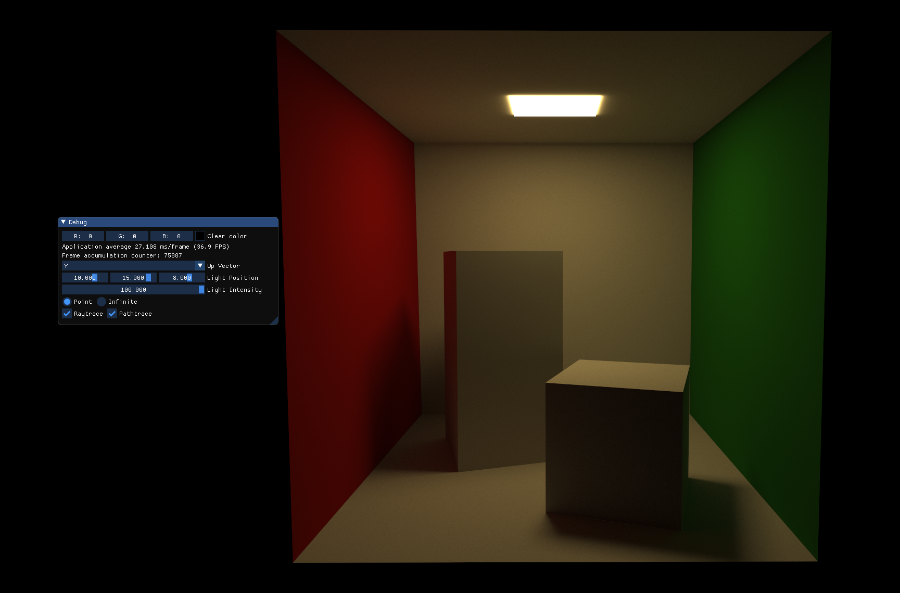

# Simple Hardware Ray Tracing - Jagi Natarajan | Eric Slyman

Implementation of ray tracing in both C++ with Vulkan backend and Javascript with WebGL backend with several additional extensions.

## Summary of Features

### C++/Vulkan

- Perspective camera
- Simple shadows
- Reflections
- Lambertian shading
- Blinn-Phong shading
- Texture support
- Animation wrt positions (parameterization of world matrix)
- Animation wrt mesh vertices (time based compute shader)
- Super-sampling (Frame jitter accumulation over time)
- Super-sampling (Multi samples per frame)
- Monte Carlo Path tracing (w/Lambertian shading only)
- Rendering control via debug panel
- Janky wasd movement

### JS/WebGL

- Perspective camera
- Lambertian shading
- Blinn-Phong shading
- Time based parameterization of colors
- Mouse based parameterization of light source position

## Setup

### C++/Vulkan

The VKExamples.sln solution within the vk_raytrace folder contains the VKExample1 project. Assuming the above requirements are satisfied, the solution should build and launch the vulkan window successfully. A debug panel allows for control of some of the scene properties, and on-the-fly toggling between using raytracing and the original object-order renderer that the example project contained.

Requirements

- An NVIDIA GPU with support for the `VK_NV_ray_trace` extension (>= GTX 1060)
- [Visual Studio](https://visualstudio.microsoft.com/downloads/) (Install the Desktop Development With C++ package)
- [Vulkan SDK](https://vulkan.lunarg.com/sdk/home)

### JS/WebGL

It is necessary to run a simple web server to get this project working due to loading external shaders. Navigate to the Web directory and run `python3 -m http.server`, then point your browser to `localhost:8000`. You should see a lambertian-shaded sphere, smoothly alternating between two colors. As you move the mouse around the canvas, the direction of the point light should change as well.

## Code Guide

### C++/Vulkan

### JS/WebGL

The skeleton for this code is a modified version of A3 with all logic pulled out to centralized sources. index.html can display a canvas for each task where the function `setupTask("ray-1", Ray1, true)` connects the canvas with id *ray-1* to the javascript function *Ray1* in the file *ray1.js*. The task file *Ray1.js* handles the setup prior to glsl. Mostly, this is loading the necessary parameters into buffers for the glsl. The glsl code has been pulled into shader files under `webgl_raytrace/shaders/`. Note that the vertex shader has very little code in it, as we want to run our program for each pixel when ray tracing. The main ray tracing code can all be found in `webgl_raytrace/shaders/fragment.glsl`.

## Samples

### C++/Vulkan

### JS/WebGL

